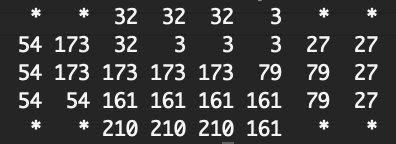

# fixstars_amplify_hackathon

## 実行方法
1. 2d_puzzle_solver.pyの6行目のコメントアウトを外してアクセストークンを入力
2. 2d_puzzle_solver.pyを実行
  > $ python3 2d_puzzle_solver.py  
3. 作りたい図形を入力  
  >空白のマスを".", 目的の図形のマスを"o"として、  
  >全体が長方形のマス目になるように作りたい図形を入力してください  
  >空行で入力を終了します  
  >..oooo..  
  >oooooooo  
  >oooooooo  
  >oooooooo  
  >..oooo..  
  >  
4. 1種類目のタイルの数を入力  
  >1種類目のタイルの数を入力してください  
  >0で入力を終了します  
  >4  
5. 1種類目のタイルの形を入力  
  >空白のマスを".", タイルのマスを"o"として、  
  >全体が長方形のマス目になるように1種類目のタイルの形を入力してください  
  >oo  
  >o.  
  >o.  
6. 以下気が済むまでタイルを入力
7. 気が済んだらタイルの数として0を入力
  >1種類目のタイルの数を入力してください  
  >0で入力を終了します  
  >0  
8. 回転、裏返しをアリにするか決める
  >回転を認めますか？(y/n): y  
  >裏返しを認めますか？(y/n): n 
    
## 実行結果
    
  * 同じ数字は1枚のタイルを表す 
  
## 提出前チェック
- [x] README.mdの手順通りにして、プログラムが実行できる
- [ ] 説明用スライドを用意した
- [x] アクセストークンはリポジトリに含まれていない
- [x] MIT Licenseにした
